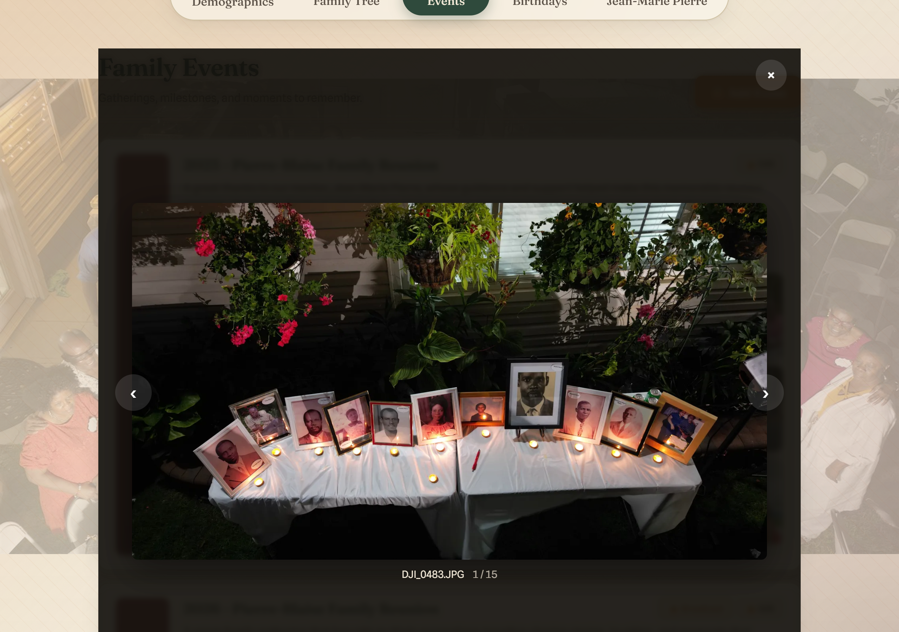
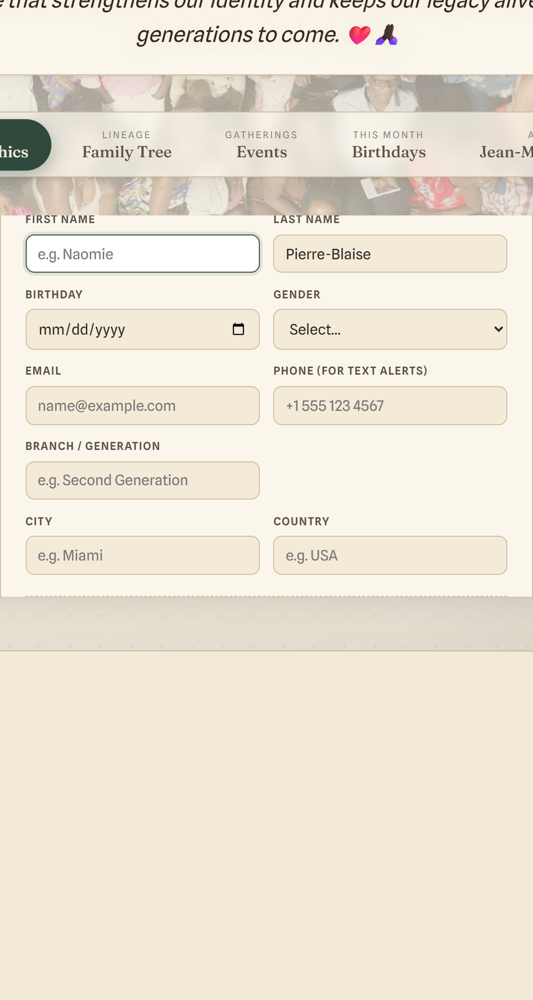
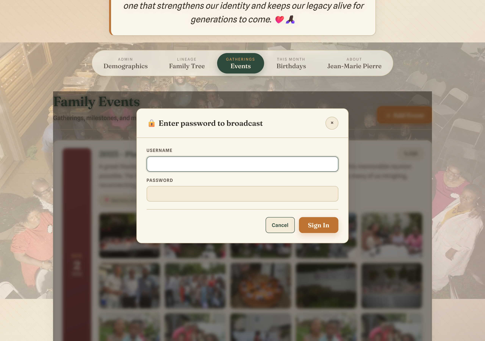
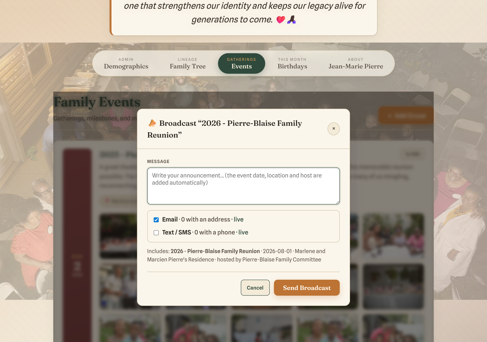

# Pierre-Blaise Family Tree — User Guide

Welcome! This guide walks through everything you can do on the family website,
for both regular visitors and family administrators.

**Website:** https://www.pierreblaisefamily.com

---

## Contents

- [Getting started](#getting-started)
- [Family Tree](#family-tree)
  - [Searching for a person](#searching-for-a-person)
  - [Printing or saving the tree as a PDF](#printing-or-saving-the-tree-as-a-pdf)
  - [Exporting the family (GEDCOM)](#exporting-the-family-gedcom)
- [Who is?](#who-is)
  - [Sharing a person's profile](#sharing-a-persons-profile)
- [How are we related?](#how-are-we-related)
- [Jean-Marie Pierre (About)](#jean-marie-pierre-about)
- [Events](#events)
  - [Viewing photos & videos](#viewing-photos--videos)
- [Birthdays](#birthdays)
- [For administrators](#for-administrators)
  - [Signing in](#signing-in)
  - [Managing family members](#managing-family-members)
  - [Adding events, photos & videos](#adding-events-photos--videos)
  - [Broadcasting an announcement](#broadcasting-an-announcement)
- [Frequently asked questions](#frequently-asked-questions)

---

## Getting started

Open **https://www.pierreblaisefamily.com** in any web browser, on a phone,
tablet, or computer. The site opens on the **Family Tree** so you see the family
right away — no sign-in needed to look around.

Across the top you'll find the navigation tabs and a thank-you note to
Jean-Marie Pierre, who gathered our family's history.

The tabs are:

| Tab | What it's for |
|-----|----------------|
| **Demographics** | Admin area to add/edit family members (🔒 sign-in required) |
| **Family Tree** | The family lineage, built automatically |
| **Who is?** | Look up one person — full details, immediate family, and their line to the root |
| **How Related?** | Pick two people and see exactly how they're related |
| **Events** | Gatherings, photos, and videos |
| **Birthdays** | Whose birthday is this month |
| **Jean-Marie Pierre** | A tribute to our family historian |

> 🔒 A lock icon means that area (or action) needs the admin password.

---

## Family Tree

The tree is built automatically from each person's **father / mother / spouse**
links — you don't arrange it by hand. Couples appear side by side, with their
children nested underneath, generation by generation (see the color legend).

- **Refresh** — reload the latest information.
- **Expand all / Collapse all** — open or close every branch at once.
- Click the **+/–** button on a couple to open or close just their branch.
- **Search by name** — jump straight to a person (see below).
- The total **member count** shows at the bottom.

### Searching for a person

Use the **Search by name** box (top of the Family Tree) to find anyone quickly.
As you type a first name, last name, or full name, the tree narrows to **just the
branch that person belongs to** — showing their ancestors (so you can see where
they fit in the lineage) and all of their descendants, while everything
unrelated is hidden.

- The matching person is **highlighted**.
- Any closed branches are **opened automatically** so the match is always
  visible.
- A count under the tree tells you how many people matched, e.g.
  *"2 matches for 'pierre'"*.
- Click the **✕** in the search box to clear it and return to the full tree.

### Printing or saving the tree as a PDF

Use the **🖨 Print / PDF** button (top of the Family Tree) to make a paper copy
or a PDF of the whole tree:

1. Click **🖨 Print / PDF**. Every branch is opened automatically first so
   nothing is left hidden, then your browser's print window appears.
2. To save a file instead of printing, set **Destination** (or "Printer") to
   **Save as PDF**.
3. For a wide tree, choose **Landscape** and let it scale to fit the page.

> 💡 Printing works best in a full web browser (Chrome, Edge, Safari, Firefox).

### Exporting the family (GEDCOM)

The **⬇ GEDCOM** button downloads the whole family as a `.ged` file — the
standard genealogy format. You can:

- Import it into genealogy programs and sites such as **Ancestry**, **Gramps**,
  or **Family Tree Maker**.
- Keep it as a portable **backup** of the family's information.

The file includes each person's name, sex, birth and (where recorded) death
dates and places, notes, and all the parent/child and spouse links.

---

## Who is?

The **Who is?** tab is a quick lookup for a single family member.

1. Type a name in the search box and pick the person from the list.
2. Their profile opens with:
   - A large **photo** and their full **details** (born, where they were born,
     branch, marital status, contact info, and — for those who have passed — the
     date of passing).
   - **Immediate family** — parents, spouse/partner, and children. Each name is
     a link, so you can hop straight to that person's profile.
   - **Line to the family root** — the direct chain of ancestors all the way back
     to the start of the family.

### Sharing a person's profile

On any profile you'll find two buttons:

- **🔗 Copy link** — copies a web address that points straight to that person.
  Paste it into a text, email, or chat; when someone opens it, the site goes
  directly to that person's profile. (On the live site the link starts with
  `https://www.pierreblaisefamily.com/…`.)
- **🖨 Print / Save PDF** — print the profile or save it as a PDF, the same way
  as the family tree.

---

## How are we related?

The **How Related?** tab answers the classic family-reunion question.

1. Choose a **first person** and a **second person** using the two search boxes
   (use the **⇄** button to swap them).
2. The site tells you exactly how the first person is related to the second —
   for example *"Marie is John's first cousin once removed."*

It understands parents and children, grandparents, siblings, aunts/uncles and
nieces/nephews, cousins (with the correct "Nth cousin, M times removed"),
spouses/partners, and in-law (by-marriage) connections. When two people share a
blood ancestor, it also shows the **shared ancestor** and each person's line up
to them, so you can see *why* they're related.

---

## Jean-Marie Pierre (About)

A tribute page honoring Jean-Marie Pierre — his photo, his upbringing, and his
accolades and contributions to preserving our family's story.

---

## Events

Family gatherings and milestones, newest details and photos included. Each event
card shows the date, title, description, location, host, and a photo/video
gallery.

### Viewing photos & videos

Each event's photos and videos appear as a **swipeable stack** — one at a time —
rather than spread side by side. To browse them:

- **Swipe left or right** (on a phone or tablet), or use the **‹ ›** arrows.
- The **dots** under the photo show how many there are and which you're on; tap a
  dot to jump straight to that one.

Click (or tap) the photo or video to open it **full-size**. In this larger view
you can:

- Use the **‹ ›** arrows (or your keyboard's left/right arrows) to move through
  all of that event's media.
- Press **Esc**, click the **×**, or tap outside the image to close.
- Play videos with full controls.

---

## Birthdays

Shows everyone whose birthday falls in the **current month**, so the family can
celebrate together. If no one has a birthday this month, you'll see a friendly
note.

---

## For administrators

Adding family members, editing events, uploading photos, and sending
announcements all require the **admin password**. Ask the family administrator
for the credentials.

### Signing in

Open the **Demographics** tab. You'll see the Admin Access sign-in. Enter the
admin password, then **Sign In**. (There's no username — just the password.)

Once signed in, you can manage the family records. (Viewing the Family Tree,
Events, and Birthdays never requires signing in — only changes do.)

### Managing family members

After signing in, the **Demographics** tab shows the **Family Roster**, a
**search box** to find anyone quickly, and an **Add Member** button. Click
**Log out** when you're done.

Click **＋ Add Member** to open the form. Fill in the details and **upload a
photo** if you have one. Notable fields:

- **Birthday** — entered as month / day / year. The **year is optional** — the
  month and day alone are enough to save (handy when a birth year isn't known).
- **Email** — used for birthday and event email announcements.
- **Phone (for text alerts)** — used for text/SMS announcements. Enter it in
  international format, e.g. `+1 555 123 4567`.
- **Marital status** of *Married* or *Partnered* requires choosing a **spouse**.
- **Deceased** — tick *"This person is deceased"* at the bottom of the form to
  record a **date of death** (also optional). On the tree and profiles this shows
  as a small **†**, and the *Who is?* page notes *"Departed this life on …"*.

To change someone later, click their entry in the roster to edit it.

> **A couple of rules to know:**
> - A person who is listed as someone's **parent can't be deleted** (it would
>   break the tree). Reassign or remove their children first.
> - Setting a **spouse** on one partner is enough — the tree pairs them
>   automatically.

### Adding events, photos & videos

On the **Events** tab (while signed in):

- **＋ Add Event** — create a new event with title, date, location, host, and
  description.
- **✎ Edit** — change or delete an existing event.
- **＋ Add photos / videos** — upload media to an event. Files upload directly to
  secure storage, so large photos and videos are supported. Hover/tap a thumbnail
  and use the **×** to remove a single item.

### Broadcasting an announcement

For **upcoming (future-dated) events**, a **📣 Broadcast** button lets you notify
the whole family by **email** and/or **text message**.

Because this messages everyone, it asks for the **password every time** — even if
you're already signed in.

After entering the password, the composer opens:

1. Type your **message**. The event's title, date, location, and host are added
   automatically.
2. Choose **Email**, **Text / SMS**, or both. Each line shows how many members
   have an address/phone, and whether that channel is **live** (will actually
   send) or **simulated**.
3. Click **Send Broadcast**. You'll see a summary of how many messages were sent.

> Only members who have an **email** (for email) or a **phone number** (for SMS)
> saved in their record will receive the announcement. Add those in the
> Demographics form.

---

## Frequently asked questions

**Do I need an account to view the family tree, events, or birthdays?**
No. Viewing is open to everyone. Only adding or changing information needs the
admin password.

**Why doesn't my edit show up on another tab right away?**
The Family Tree is rebuilt when you open it or press **Refresh**. Switch to the
tab and refresh to see the latest.

**Someone's photo is missing.**
If a person has no photo yet, a friendly person emoji is shown in its place —
chosen to match their **sex** (and using a skin tone that reflects our family).
Upload a photo any time in the Demographics form to replace it.

**Are the original full-size photos kept?**
Yes. Galleries load smaller, fast versions for speed; the full-resolution files
are stored safely and shown when you open a photo full-size.

**A family member didn't get the announcement.**
Check that they have an **email** (for email) and a **phone number** in
international `+1…` format (for SMS) saved in their record, and that the channel
showed as **live** when you sent it.
